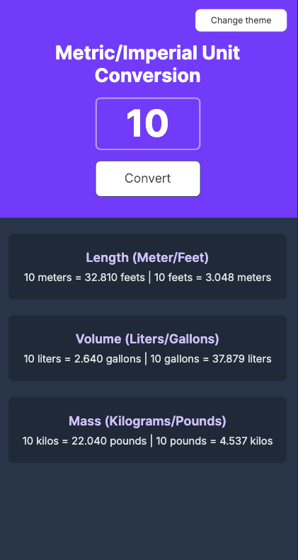
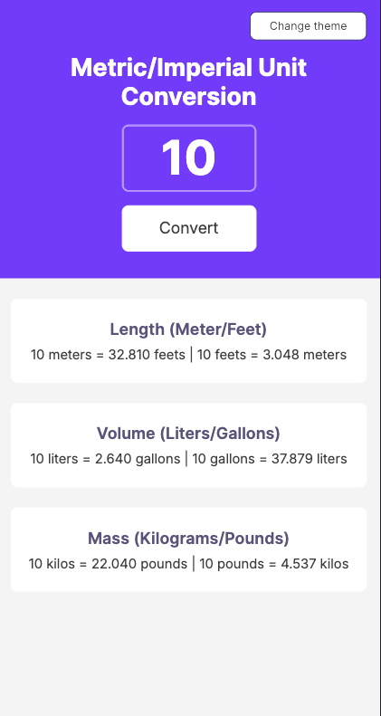

# 🧮 Unit Converter – Metric ↔ Imperial

A simple, lightweight **Metric ↔ Imperial unit converter** built as a solo project while completing the Scrimba Frontend Developer Path.

---

## 🚀 Features

- Converts **length** (meters ↔ feet), **volume** (liters ↔ gallons), and **mass** (kilograms ↔ pounds)
- Real-time conversion on input with proper rounding to **three decimal places**
- 🌙 Dark / ☀️ Light theme toggle with smooth transitions
- Fully responsive and keyboard-friendly

---

## 📚 What I Learned

While building this project, I practiced:

- **JavaScript**
    - Converting `input.value` strings to numbers safely
    - Rounding numbers to three decimal places (`toFixed(3)`)
    - Event handling, DOM manipulation, and `localStorage` for theme persistence
- **CSS**
    - CSS variables for theming (`[data-theme]`)
    - Smooth transitions and responsive layouts
- **Web App Essentials**
    - PWA setup via manifest
    - Accessibility improvements (screen reader labels, semantic HTML)

---

## 🛠️ Installation & Usage

1. Open **[Unit converter](https://unit-converter-solo.netlify.app/)**
2. Enter a number in the input field
3. Click **Convert** or press **Enter** to see conversions
4. Toggle between dark and light themes using the **Change Theme** button

---

## 📂 Project Info

- **Built With:** HTML, CSS, JavaScript
- **Hosting:** Netlify
- **Type:** PWA-ready

---

## 📸 Screenshots

  
  

